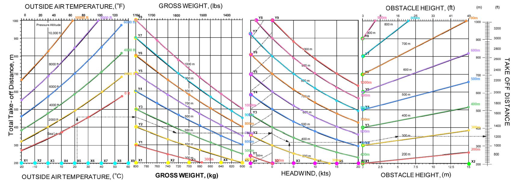

# rPerf Tools

Tools for creating aircraft performance profiles for the [rPerf](https://github.com/diaznet/rPerf) app.

## Structure

- `poh-chart-digitizer/` — Digitize POH multi-part performance charts into CSV data
- `aircraft-profile-generator/` — Merge digitized CSVs into a complete rPerf aircraft profile (CSV)
- `plane_samples/` — Example output files
- `docs/images/` — Documentation images

## Quick Start

Open `poh-chart-digitizer/index.html` to digitize charts, then `aircraft-profile-generator/index.html` to build the final profile.

---

## POH Chart Digitizer

Open `poh-chart-digitizer/index.html` in your browser.

### How the chart works

POH performance charts have multiple sections that chain together, sharing a common Y axis (pixel height). The tool supports up to 4 sections:

1. **Outside Air Temperature (OAT)**: Enter with temperature (X axis), go up to your **altitude line**, then draw a horizontal line across to the next section.
2. **Gross Weight**: Weight (kg) on X axis, Distance (meters) on Y axis. **Reference curves** (guide lines) define the interpolation field. You enter at the crossover height from the OAT section, then follow/interpolate between the curves rightward until you reach your weight.
3. **Wind** *(optional)*: Headwind/tailwind (kt) on X axis. Same curve-following principle. Negative values = tailwind, positive = headwind.
4. **Obstacle Height** *(optional)*: Obstacle height (m) on X axis. Same curve-following principle. The tool computes at 0 m (ground roll) and 15 m (over 50 ft) automatically.

The OAT section has altitude lines (e.g. 0, 2000, 4000, 8000 ft). All other sections have independent reference curves — they are NOT paired with altitudes.

### Usage

#### 1. Load Image

Load your chart image. Use **mouse wheel** to zoom.

#### 2. Calibrate Gross Weight Section

Click "Start Calibration" — click X points first (weight axis), then Y points (distance axis).

Default X points: 800, 900, 1000 kg (click "+Add" for more).
Default Y points: 0, 1000 m (click "+Add" for more).

#### 3. Calibrate Outside Air Temperature Section

Same process but **X points only** (temperature axis). No Y calibration needed — the crossover uses pixel heights directly.

Default X points: -20, -10, 0, 10, 20, 30, 40 °C (click "+Add" for more).

The status bar shows real-world coordinates as you move the mouse — use this to verify calibration.

#### 4. Calibrate Wind Section *(optional)*

Skip if your chart has no wind section. Calibrate X points (wind in kt, negative = tailwind) and Y points (distance in m).

Default X points: -10, 0, 10, 20 kt.

#### 5. Calibrate Obstacle Section *(optional)*

Skip if your chart has no obstacle height section. Calibrate X points (obstacle height in m) and Y points (distance in m).

Default X points: 0, 15 m.

#### 6. Trace Altitude Lines — Outside Air Temperature

For each altitude (0, 2000, 4000, 8000 ft):

1. Select the altitude from the dropdown
2. Click **Trace**
3. Click along the line from left to right (6–8 points, more where it curves)
4. Click **Done**

Use **Undo** to remove the last point if you misclick.

#### 7. Trace Reference Curves — Gross Weight

The gross weight section has **reference curves** (guide lines) that define the interpolation field. For each visible curve:

1. Select the curve from the dropdown
2. Click **Trace**
3. Click along the curve from left to right (or top to bottom)
4. Click **Done**

These curves are independent — they don't correspond to specific altitudes. The computation interpolates between them.

#### 8. Trace Reference Curves — Wind *(optional)*

Same process as step 7, but for the wind section's reference curves. Skip if not calibrated.

#### 9. Trace Reference Curves — Obstacle *(optional)*

Same process as step 7, but for the obstacle section's reference curves. Skip if not calibrated.

#### 10. Compute & Export

1. Set the temperature range and step (default: -20 to 40°C, step 5°C)
2. Enter the weights to sample (default: 800, 900, 1000 kg)
3. If the wind section is active, enter **wind sample values** (default: -10, -5, 5, 10, 15, 20 kt). The tool computes baseline distances at 0 kt, then samples each wind value to derive average **headwind %/kt** and **tailwind %/kt** correction factors.
4. Select chart type (**Takeoff** or **Landing**)
5. If the obstacle section is **not** active, select distance type (**Ground Roll** or **Over 50ft/15m**). If it **is** active, both are computed automatically.
6. Click **Compute Grid**
7. Review the data in the text area (wind correction factors are shown at the bottom if applicable)
8. Click **Export CSV** to download

The exported CSV uses rPerf-compatible headers: `weightKg`, `pressureAltitudeFt`, `temperatureC`, and distance columns. When the obstacle section is active, both ground roll and over-50 columns are included.

**Save/Load Project**: Save your calibration and traced lines as JSON to resume later (re-load the same image after loading a project). The project file uses the same name as the loaded image.

---

## Aircraft Profile Generator

Open `aircraft-profile-generator/index.html` in your browser. This tool creates a complete aircraft profile for rPerf:

1. Fill in aircraft info (ID, registration, name, MTOW, runway type)
2. Set correction factors (headwind/tailwind %/kt, slope %/%) — these are **auto-filled** if the loaded CSVs already contain them
3. Load one or more digitized CSVs (takeoff and/or landing)
4. Click **Generate** — the tool merges on the common key (`weightKg`, `pressureAltitudeFt`, `temperatureC`)
5. Edit data in the table if needed (modify cells, add/delete rows)
6. Export as **CSV** — ready for direct import into rPerf

**Temperature**: The format uses `temperatureC` (absolute OAT in °C) everywhere. No conversion is applied — values are passed through as-is. The rPerf app internally converts to delta ISA for interpolation.

See `plane_samples/` for example output files.

---

## Workflow

### Simple chart (2 sections: OAT + Weight)

1. Load the chart image, calibrate OAT and Gross Weight sections
2. Trace altitude lines and reference curves
3. Select chart type + distance type, compute, export CSV
4. Repeat for other charts (e.g. landing)
5. Open the profile generator to merge CSVs into one file

### Complex chart (4 sections: OAT + Weight + Wind + Obstacle)

1. Load the chart image, calibrate all 4 sections
2. Trace altitude lines and reference curves for each section
3. Enter wind sample values, select chart type, compute — both ground roll and over-50 distances are produced automatically, plus wind correction factors
4. Export CSV
5. Open the profile generator, enter the computed wind correction factors, merge with other CSVs

---

*Vibe-coded with ❤️ for fun*
